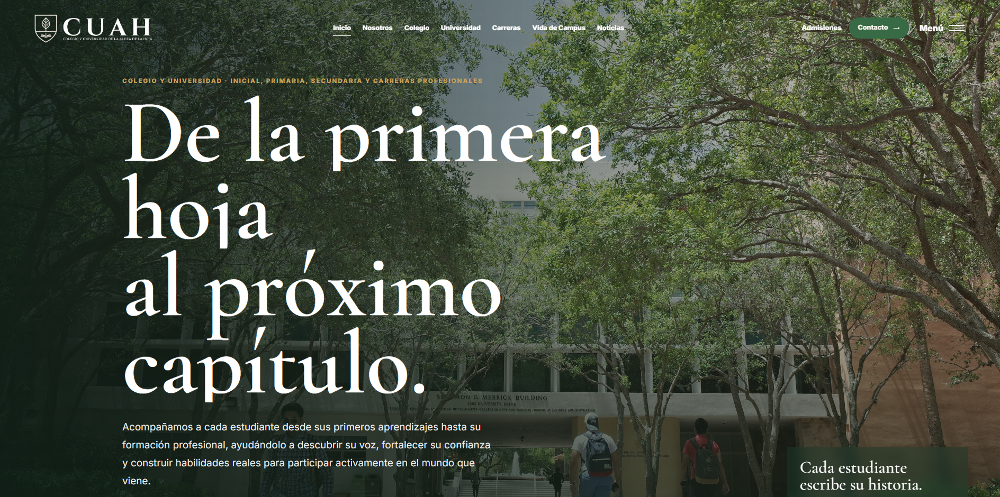
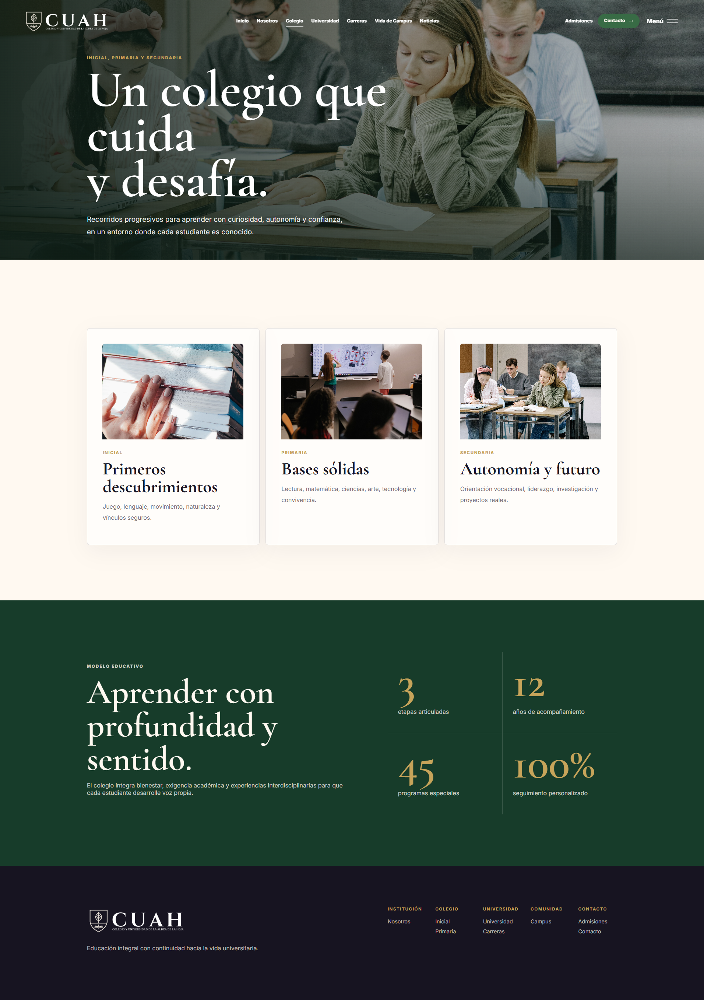
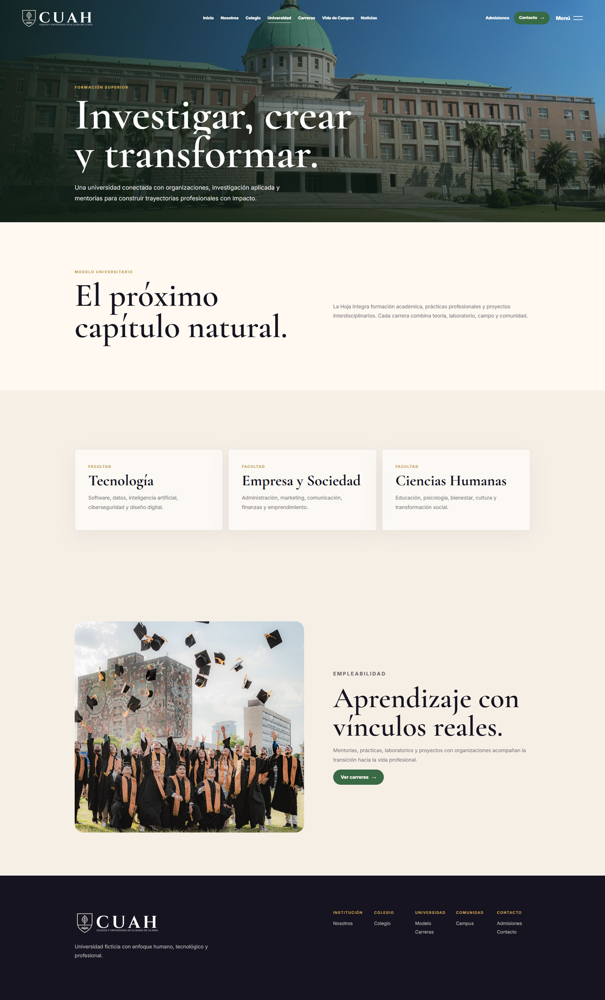
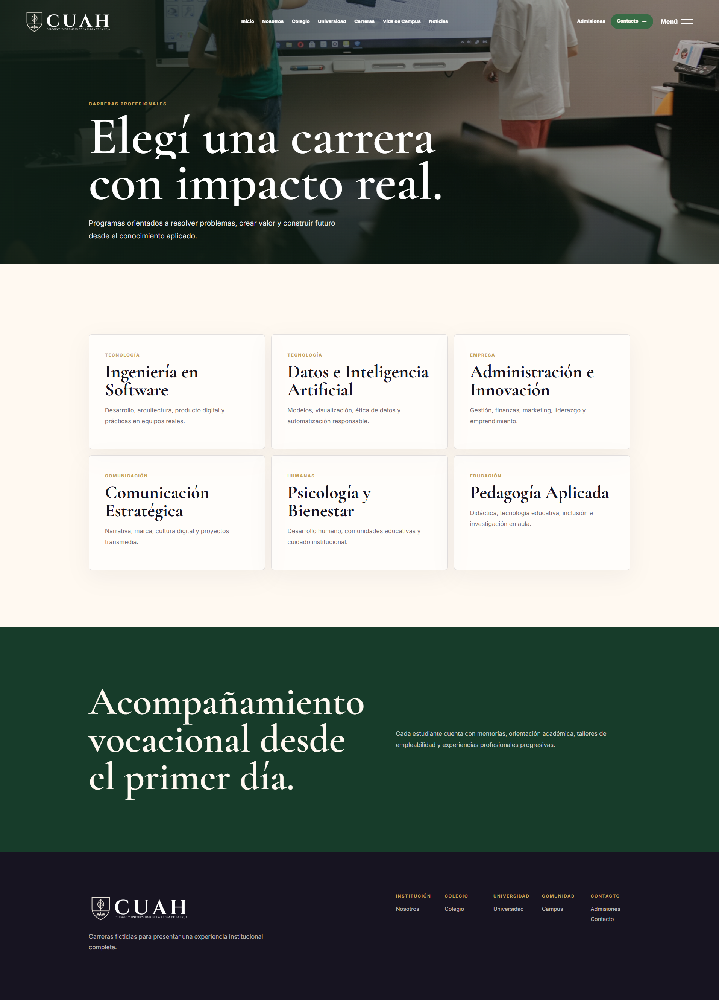
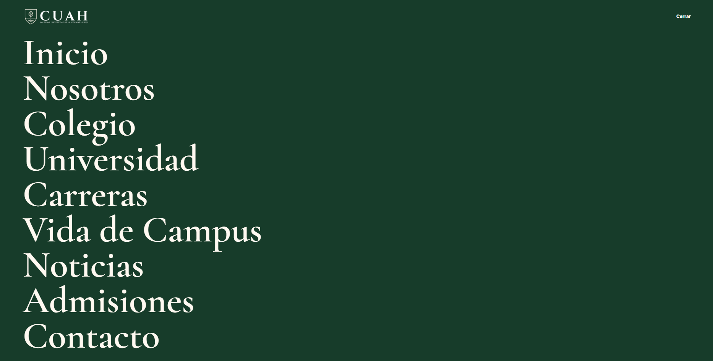

# Colegio y Universidad de la Hoja

Sitio institucional ficticio y responsive para **Colegio y Universidad de la Hoja**. El proyecto está construido con HTML, CSS y JavaScript vanilla, usando únicamente el logo y las imágenes locales de la carpeta `assets`.

## Capturas



| Inicio | Nosotros | Colegio | Universidad |
|---|---|---|---|
|  |  |  |  |

| Carreras | Vida de Campus | Admisiones | Menú |
|---|---|---|---|
|  |  |  |  |

## Estructura

```txt
.
├── assets/          # Logo e imágenes reales usadas por el sitio
│   └── optimized/   # Versiones WebP y AVIF generadas por Gulp
├── capturas/        # Capturas del proyecto
├── css/
│   └── styles.css   # Estilos globales, responsive y animaciones
├── dist/            # CSS/JS minificados generados por build
├── js/
│   └── app.js       # Menú, scroll, reveals, contadores y formularios
├── gulpfile.js      # Pipeline de imágenes, CSS y JS
├── package.json
├── index.html
├── nosotros.html
├── colegio.html
├── universidad.html
├── carreras.html
├── vida-campus.html
├── noticias.html
├── admisiones.html
└── contacto.html
```

## Páginas

- Inicio
- Nosotros
- Colegio
- Universidad
- Carreras
- Vida de Campus
- Noticias
- Admisiones
- Contacto

## Características

- Diseño institucional premium, editorial y responsive.
- Menú fullscreen para navegación principal.
- Header con cambio visual al hacer scroll.
- Animaciones suaves con `IntersectionObserver`.
- Contadores animados.
- Formularios de contacto/admisión con confirmación local.
- Uso exclusivo de recursos locales desde `assets`.
- Imágenes optimizadas en AVIF y WebP.

## Uso

Abrí `index.html` directamente en el navegador o serví la carpeta con cualquier servidor estático.

```bash
npx serve .
```

## Optimización

El proyecto incluye un pipeline con Gulp para optimizar recursos:

```bash
npm install
npm run images   # genera WebP y AVIF en assets/optimized
npm run styles   # autoprefixer + minificación CSS en dist/css
npm run scripts  # minificación JS en dist/js
npm run build    # ejecuta todo lo anterior
```

Las páginas usan `<picture>` para servir AVIF primero, WebP después y mantener compatibilidad con navegadores modernos.

## Créditos

Diseño y desarrollo: [Nathan de Barros](https://nathandebarros.com)

## Licencia

Este proyecto se publica bajo licencia MIT. Ver [LICENSE](LICENSE).
